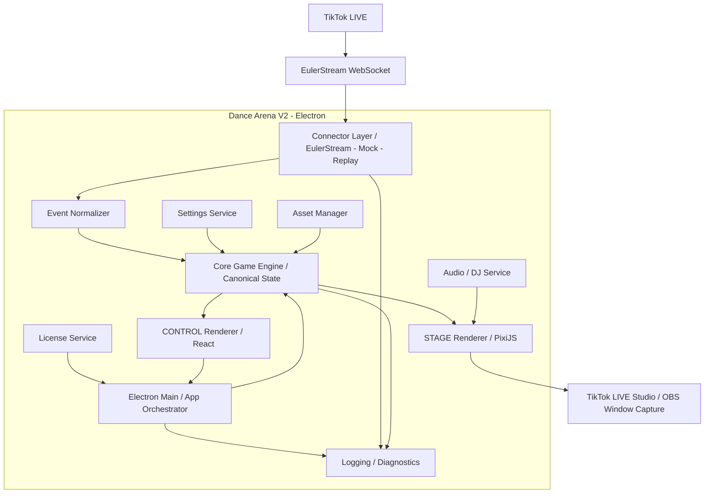
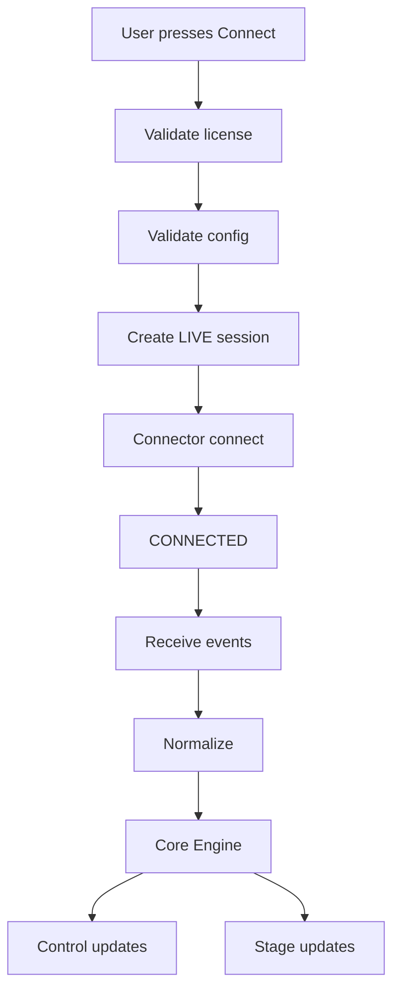
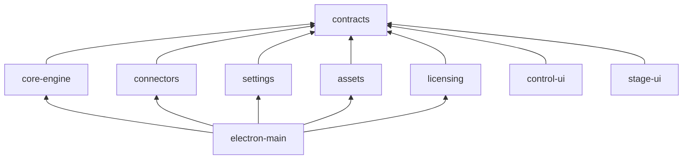

# A — Blueprint kiến trúc Dance Arena V2

> Tài liệu nguồn sự thật cho kiến trúc V2. Claude phải bám theo tài liệu này khi triển khai code. Mọi thay đổi kiến trúc lớn cần được cập nhật lại tài liệu trước hoặc cùng lúc với code.

## 1. Kiến trúc tổng thể



Luồng chuẩn:

```text
TikTok
  ↓
EulerStream
  ↓
Connector
  ↓
Normalizer
  ↓
Core Engine
  ├──→ CONTROL
  └──→ STAGE
```

**Nguyên tắc:** CONTROL chỉ điều khiển, STAGE chỉ render, Core Engine là nguồn sự thật duy nhất.

---

## 2. Nguyên tắc dữ liệu

Có 4 lớp dữ liệu:

### 2.1 Raw Event
Dữ liệu connector nhận trực tiếp từ EulerStream/TikTok.

- Không tin tưởng hoàn toàn.
- Schema có thể thay đổi.
- Không được dùng trực tiếp trong gameplay/render.

### 2.2 Normalized Event
Schema nội bộ của Dance Arena:

- `GiftEvent`
- `CommentEvent`
- `FollowEvent`
- `ShareEvent`
- `JoinEvent`
- `LikeEvent`

### 2.3 Domain / Game State
Core Engine sở hữu:

- User
- Dancer
- Queue
- Ranking
- VIP
- GiftScore
- PartyGoal
- Spotlight
- GameSession

### 2.4 Render State / Stage Events
STAGE chỉ nhận dữ liệu tối thiểu cần để render:

- `DancerSpawn`
- `DancerMove`
- `DancerRemove`
- `GiftEffect`
- `RankChanged`
- `SpotlightStarted`
- `Announcement`

Không gửi nguyên payload TikTok xuống renderer.

---

## 3. Ownership

| Thành phần | Quyền sở hữu / trách nhiệm |
|---|---|
| Electron Main | lifecycle, IPC, services |
| Connector | kết nối LIVE |
| Normalizer | raw → normalized |
| Core Engine | **canonical game state** |
| CONTROL | view + gửi command |
| STAGE | render animation |
| Settings | config |
| License | entitlement |
| Asset Manager | asset metadata |
| Logs | diagnostics |

Ví dụ khi CONTROL bấm **Kick dancer**:

```text
CONTROL
  ↓ IPC
Core Engine
  ↓ validate command
remove dancer
  ↓ broadcast
CONTROL + STAGE
```

CONTROL không tự xóa dancer khỏi state.

---

## 4. Electron Main

```text
Main Process
│
├── AppLifecycleManager
├── WindowManager
├── IpcRouter
├── ConnectorManager
├── CoreRuntime
├── SettingsService
├── LicenseService
├── AssetService
├── LoggingService
└── DiagnosticsService
```

`main.ts` không chứa gameplay logic.

Sai:

```ts
if (gift.diamond > 1000) {
  vipUser(...)
}
```

Đúng:

```ts
engine.handleEvent(event)
```

---

## 5. Window Manager

Quản lý:

- CONTROL window
- STAGE window
- Splash/onboarding
- License activation

API nội bộ:

```ts
openControl()
openStage()
closeStage()
reloadStage()
setStageAlwaysOnTop()
setStageBounds()
setStageFullscreen()
```

STAGE cần hỗ trợ:

- 720×1280
- 1080×1920
- tỉ lệ 9:16
- transparent optional
- borderless
- always-on-top optional

---

## 6. Connector Layer

Không để toàn hệ thống phụ thuộc trực tiếp EulerStream.

```ts
interface LiveConnector {
  connect(config: ConnectorConfig): Promise<void>;
  disconnect(): Promise<void>;

  onEvent(
    callback: (event: RawLiveEvent) => void
  ): Unsubscribe;

  onStatus(
    callback: (status: ConnectorStatus) => void
  ): Unsubscribe;
}
```

Implementations:

```text
connectors/
├── EulerStreamConnector
├── MockConnector
└── ReplayConnector
```

### EulerStreamConnector chỉ làm

- connect
- authenticate
- listen WebSocket
- heartbeat
- reconnect
- parse message
- emit raw event

Không làm ranking, VIP, queue, gift FX hay spawn dancer.

---

## 7. Connection State Machine

Không dùng một boolean đơn giản.

```ts
type ConnectorStatus =
  | "idle"
  | "connecting"
  | "connected"
  | "reconnecting"
  | "disconnecting"
  | "error";
```

Flow:

```text
IDLE
 ↓
CONNECTING
 ↓
CONNECTED
 ↓
RECONNECTING
 ↓
CONNECTED
```

hoặc:

```text
CONNECTING
 ↓
ERROR
```

---

## 8. Reconnect Strategy

Backoff:

```text
1s → 2s → 4s → 8s → 15s → 30s
```

Sau đó giữ tối đa 30 giây.

Thêm jitter khoảng ±10–20%.

Không reset game state khi mất kết nối ngắn.

---

## 9. Event Normalizer

Input:

```text
Euler raw object
```

Output:

```text
DanceArenaEvent v1
```

```ts
interface BaseLiveEvent {
  version: 1;
  type:
    | "comment"
    | "gift"
    | "follow"
    | "share"
    | "join"
    | "like";
  timestamp: number;
  user: LiveUser;
}
```

---

## 10. User Schema

```ts
interface LiveUser {
  platformUserId: string;
  uniqueId?: string;
  nickname: string;
  avatarUrl?: string;
}
```

Không dùng nickname làm ID vì nickname có thể trùng hoặc thay đổi.

---

## 11. Comment Event

```ts
interface CommentEvent {
  version: 1;
  type: "comment";
  timestamp: number;
  user: LiveUser;
  comment: string;
}
```

Normalizer có thể sinh thêm `normalizedComment`.

Ví dụ:

```text
"VÀO"
"vao"
" Vào "
```

đều normalize thành:

```text
VAO
```

---

## 12. Gift Event

```ts
interface GiftEvent {
  version: 1;
  type: "gift";
  timestamp: number;
  user: LiveUser;
  gift: {
    id?: string;
    name: string;
    diamondValue: number;
    repeatCount: number;
    totalDiamonds: number;
    streak: boolean;
    streakEnded: boolean;
    transactionId?: string;
    imageUrl?: string;
  };
}
```

Nếu provider không trả tổng trực tiếp:

```text
totalDiamonds = diamondValue × repeatCount
```

---

## 13. Gift Deduplication

Gift streak có thể gửi x1, x2, x3, x4. Không được cộng 1+2+3+4 thành 10 khi thực tế là 4.

Tạo `GiftDeduplicationService`.

Ưu tiên key:

```text
transactionId
```

Fallback:

```text
userId + giftId + timestampWindow
```

---

## 14. Core Game Engine

```text
CoreGameEngine
│
├── SessionEngine
├── UserRegistry
├── CommandEngine
├── QueueEngine
├── DancerEngine
├── GiftEngine
├── RankingEngine
├── VipEngine
├── PartyGoalEngine
├── SpotlightEngine
└── AutoHostEngine
```

Core Engine phải là **pure TypeScript package**.

Không phụ thuộc:

- Electron
- React
- PixiJS

---

## 15. Game State tổng

```ts
interface GameState {
  session: SessionState;
  users: Record<string, UserState>;
  dancers: DancerState[];
  queue: QueueEntry[];
  ranking: RankingState;
  vip: VipState;
  partyGoal: PartyGoalState;
  spotlight?: SpotlightState;
  counters: SessionCounters;
}
```

---

## 16. User Registry

Mỗi user chỉ tồn tại một entity theo `platformUserId`.

```ts
interface UserState {
  id: string;
  uniqueId?: string;
  nickname: string;
  avatarUrl?: string;
  totalDiamonds: number;
  giftCount: number;
  follow: boolean;
  lastSeenAt: number;
  lastGiftAt?: number;
  activeDancerId?: string;
  queueEntryId?: string;
}
```

---

## 17. Command Engine

Flow:

```text
Comment
  ↓ normalize
CommandParser
  ↓
Command
  ↓ cooldown check
Game Action
```

Các alias:

```text
GO
JOIN
VÀO
VAO
```

→ `JOIN_STAGE`

```ts
type GameCommand =
  | "JOIN_STAGE"
  | "MOVE_LEFT"
  | "MOVE_RIGHT"
  | "MOVE_DOWN"
  | "MOVE_VIP";
```

Cho phép custom alias từ CONTROL.

---

## 18. Command Cooldown

```ts
interface CommandCooldownConfig {
  join: number;
  movement: number;
  vip: number;
}
```

Theo key:

```text
userId + commandType
```

Không hard-code cooldown sâu trong engine.

---

## 19. Queue Engine

```ts
interface QueueEntry {
  id: string;
  userId: string;
  joinedAt: number;
  priorityScore: number;
  diamondsWhileWaiting: number;
  lastGiftAt?: number;
}
```

Default:

```text
maxQueueSize = 200
```

Configurable.

---

## 20. Priority Formula

Tạo `PriorityStrategy` thay vì nhét comparator phức tạp khắp nơi.

Default ưu tiên:

```text
giftCount
↓
totalDiamonds
↓
lastGiftAt
↓
joinedAt
```

Có thể hỗ trợ mode:

- FIFO
- Gift Priority
- Highest Diamond
- Recent Supporter
- Random

---

## 21. Dancer Engine

Dancer là entity riêng, không đồng nghĩa với user.

```ts
interface DancerState {
  dancerId: string;
  userId: string;
  slotId: string;
  zone: "normal" | "vip";
  costumeId: string;
  position: {
    x: number;
    y: number;
  };
  status:
    | "entering"
    | "active"
    | "leaving";
}
```

---

## 22. Slot System

Engine quản lý logical slots:

```text
normal-01 ... normal-30
vip-01 ... vip-10
```

STAGE map slot sang tọa độ.

Dùng normalized coordinates từ `0.0 → 1.0` thay vì pixel cứng để scale 720p/1080p/1440p.

---

## 23. Ranking Engine

Không ranking lại mọi user mỗi frame.

Chỉ update khi:

- gift arrived
- score changed
- user removed/reset

```ts
interface RankingEntry {
  rank: number;
  userId: string;
  totalDiamonds: number;
  previousRank?: number;
}
```

---

## 24. VIP Engine

Flow:

```text
Gift
 ↓
Ranking update
 ↓
Top10 changed?
 ↓
VIP Engine
 ↓
VIP reassignment
 ↓
Stage events
```

Ví dụ rank 11 → 10 emit `VIP_PROMOTED`; rank 10 → 11 emit `VIP_DEMOTED`.

STAGE chỉ animate, không tự quyết định VIP.

---

## 25. Party Goal Engine

```ts
interface PartyGoalState {
  enabled: boolean;
  current: number;
  target: number;
  completedCount: number;
}
```

Gift cộng diamond vào goal.

Khi `current >= target`, emit `PARTY_GOAL_COMPLETED`, sau đó xử lý FX/TTS/celebration và chính sách reset hoặc tăng goal.

---

## 26. Gift Tier Engine

Không đặt các `if diamond < ...` trong renderer.

```ts
interface GiftTier {
  id: string;
  minDiamonds: number;
  maxDiamonds?: number;
  effectPreset: string;
  duration: number;
  priority: number;
}
```

Default tier:

```text
tier-1: 1–9
tier-2: 10–49
tier-3: 50–199
tier-4: 200–999
tier-5: 1000+
```

---

## 27. Gift → Effect Pipeline

```text
GiftEvent
  ↓
GiftEngine
  ↓ calculate score
RankingEngine
  ↓
EffectResolver
  ↓
StageEvent
```

Ví dụ event render:

```json
{
  "type": "gift-effect",
  "effect": "mega-cosmic",
  "userId": "abc",
  "duration": 8000
}
```

---

## 28. Stage Renderer Architecture

PixiJS layers:

```text
StageApplication
│
├── BackgroundLayer
├── DJLayer
├── EnvironmentLayer
├── NormalDancerLayer
├── VIPLayer
├── ParticleLayer
├── GiftFXLayer
├── OverlayLayer
└── AnnouncementLayer
```

Z-order cố định.

---

## 29. Snapshot + Incremental Events

Không gửi full `GameState` mỗi frame.

Khi STAGE mở/reload:

```text
GAME_STATE_SNAPSHOT
```

Sau đó chỉ gửi delta events:

- `DANCER_SPAWN`
- `DANCER_MOVE`
- `DANCER_REMOVE`
- `RANK_CHANGED`
- `GIFT_EFFECT`
- `SPOTLIGHT_START`
- `SPOTLIGHT_END`
- `ANNOUNCEMENT`

---

## 30. Stage Event Bus

```ts
type StageEvent =
  | DancerSpawnEvent
  | DancerMoveEvent
  | DancerRemoveEvent
  | GiftEffectEvent
  | RankingChangeEvent
  | SpotlightEvent
  | AnnouncementEvent
  | PartyGoalEvent;
```

```text
IPC
 ↓
StageEventBus
 ↓
relevant renderer subsystem
```

---

## 31. Dancer Visual Entity

```text
DancerView
│
├── BodySprite
├── AvatarMask
├── NameLabel
├── RankBadge
├── GiftAura
└── EmojiBubble
```

Avatar pipeline:

```text
remote image
 ↓ cache
texture
 ↓ circle mask
```

Nếu tải avatar lỗi → default avatar.

---

## 32. Asset System

Không hard-code đường dẫn asset trong logic.

```ts
interface AssetDefinition {
  id: string;
  type:
    | "body"
    | "vip-body"
    | "effect"
    | "background"
    | "dj"
    | "ui";
  source: string;
  metadata: Record<string, unknown>;
}
```

---

## 33. Asset Manifest

```json
{
  "id": "vip-female-01",
  "type": "vip-body",
  "source": "vip/female/f1.webp",
  "metadata": {
    "gender": "female",
    "rankCompatible": true
  }
}
```

---

## 34. Avatar/Image Cache

```text
AvatarCache
│
├── memory cache
└── disk cache
```

Key = `hash(url)`.

TTL gợi ý 24–72 giờ.

---

## 35. CONTROL Architecture

React app:

```text
App
│
├── Dashboard
├── LiveConnection
├── Queue
├── Ranking
├── StageControl
├── GiftRules
├── Commands
├── AutoHost
├── DJ
├── AssetManager
├── Simulator
├── Settings
└── Diagnostics
```

---

## 36. CONTROL Layout

```text
┌───────────┬────────────────────────────────┐
│ SIDEBAR   │ HEADER                         │
│           ├────────────────────────────────┤
│ Dashboard │                                │
│ Live      │          MAIN CONTENT          │
│ Stage     │                                │
│ Gifts     │                                │
│ Users     │                                │
│ Assets    │                                │
│ Auto Host │                                │
│ Simulator │                                │
│ Settings  │                                │
└───────────┴────────────────────────────────┘
```

Header:

- TikTok account
- LIVE status
- viewer count
- session time
- license status

---

## 37. Dashboard

Cards:

- LIVE STATUS
- VIEWERS
- ACTIVE DANCERS
- QUEUE
- SESSION DIAMONDS
- TOP SUPPORTER

Bên dưới:

- Live Event Feed
- Top 10 Ranking
- Quick Simulator
- Stage Preview

---

## 38. IPC Architecture

Namespace chuẩn:

```text
app:
connector:
game:
stage:
settings:
assets:
license:
diagnostics:
```

Không dùng các tên chung chung như `do-stuff`, `abc`, `message`.

---

## 39. CONTROL → Main IPC

Ví dụ:

```text
connector:connect
connector:disconnect

game:kick-user
game:clear-stage
game:reset-ranking
game:set-party-goal

stage:open
stage:close
stage:set-layout

settings:update

simulator:emit-event
```

---

## 40. Main → CONTROL

```text
connector:status
game:snapshot
game:queue-updated
game:ranking-updated
game:session-stats
license:state
diagnostics:error
```

---

## 41. Main → STAGE

```text
stage:snapshot
stage:dancer-spawn
stage:dancer-remove
stage:dancer-move
stage:gift-effect
stage:ranking-change
stage:spotlight
stage:announcement
stage:party-goal
```

---

## 42. IPC Security

Renderer không truy cập trực tiếp:

- `fs`
- `process`
- Node APIs

Electron config:

```text
nodeIntegration: false
contextIsolation: true
sandbox: true
```

Preload chỉ expose whitelist.

Ví dụ:

```ts
window.danceArena.connect()
window.danceArena.disconnect()
window.danceArena.stage.open()
```

Không expose `ipcRenderer` trực tiếp.

---

## 43. Settings Architecture

```text
SettingsService
│
├── load
├── validate
├── migrate
├── update
├── export
└── import
```

Schema phải có `configVersion`.

```json
{
  "configVersion": 3,
  "stage": {},
  "commands": {},
  "gift": {},
  "autoHost": {}
}
```

---

## 44. Settings Migration

Nếu app mới cần config v3 nhưng user đang ở v2:

```text
migrateV2ToV3()
```

Không làm mất config khi update app.

---

## 45. Sensitive Settings

Không để API key trong config export thông thường.

Tách:

```text
settings.json
```

và secret storage.

Trên Windows ưu tiên encryption dựa trên OS nếu triển khai được.

CONTROL chỉ cần biết:

```text
API key configured: true
```

không cần nhận secret plaintext liên tục.

---

## 46. License Architecture

```text
LicenseService
│
├── MachineIdentity
├── SignatureVerifier
├── EntitlementResolver
├── TrialManager
└── LicenseWatcher
```

```ts
type LicenseState =
  | "trial"
  | "active"
  | "expired"
  | "invalid"
  | "grace-period";
```

---

## 47. License Watcher

Watcher lifecycle:

```text
App start
 ↓
start watcher
 ↓
app shutdown
 ↓
stop watcher
```

Không gắn watcher lifecycle với LIVE connect/disconnect. Đây là lỗi thiết kế phải tránh từ bản cũ.

---

## 48. Entitlement Gate

Không chỉ khóa UI.

Core command `CONNECT_LIVE` phải check entitlement.

Stage startup cũng check khi cần.

Sửa CSS/UI không được bypass logic entitlement bình thường.

---

## 49. Auto Host Engine

```text
Live Event
 ↓
AutoHostRuleEngine
 ↓ matching rules
cooldown
 ↓
AutoHostAction
```

```ts
interface AutoHostRule {
  trigger: string;
  conditions: Condition[];
  cooldownMs: number;
  actions: HostAction[];
}
```

---

## 50. Host Actions

- `SHOW_ANNOUNCEMENT`
- `TTS`
- `START_SPOTLIGHT`
- `SHOW_EFFECT`
- `START_MINIGAME`

---

## 51. TTS Queue

Không cho nhiều voice nói chồng nhau.

Priority gợi ý:

```text
1000💎 gift
> follow
> comment
> generic reminder
```

TTS Queue cần:

- max queue
- duplicate suppression
- cooldown
- interrupt priority

---

## 52. DJ / Audio Engine

```text
AudioEngine
│
├── Player
├── Analyzer
├── BeatDetector
├── BpmClock
└── ReactiveSignal
```

Output tối giản:

- `bassIntensity`
- `midIntensity`
- `highIntensity`
- `beat`
- `bpm`

STAGE dùng signal này để animate.

---

## 53. Simulator

Simulator không bypass pipeline.

Sai:

```text
Simulator → direct Stage
```

Đúng:

```text
Simulator
 ↓
MockConnector
 ↓
Normalizer
 ↓
Engine
 ↓
Stage
```

---

## 54. Replay Engine

Session log dạng:

```json
{
  "at": 1234,
  "event": {}
}
```

Replay timeline:

```text
0ms comment
2000ms gift
3500ms gift
5000ms follow
```

Controls:

- play
- pause
- 2x
- 5x
- seek

Mục tiêu: debug gameplay và test regression không cần LIVE thật.

---

## 55. Event Logging

Levels:

- INFO
- WARN
- ERROR
- DEBUG

Production: INFO+.
Debug build: DEBUG.

File rotation gợi ý:

```text
10MB/file
max 5–10 files
```

Không log raw event vô hạn.

---

## 56. Diagnostics Bundle

CONTROL có nút `Export Diagnostics`.

ZIP gồm:

```text
app-version.txt
system-info.json
settings-sanitized.json
connector.log
engine.log
renderer-errors.log
```

Không chứa API key hoặc secret.

---

## 57. Session Lifecycle — Connect



---

## 58. Disconnect Lifecycle

```text
Disconnect requested
 ↓
Connector stop accepting events
 ↓
flush pending gift streak
 ↓
close WebSocket
 ↓
final session state
 ↓
save session stats
 ↓
status = idle
```

Option:

- Keep Stage State
- Clear Stage

---

## 59. App Startup

```text
Electron boot
 ↓
Logger init
 ↓
Settings init
 ↓
Settings migration
 ↓
License init
 ↓
Asset registry init
 ↓
Core Engine init
 ↓
IPC init
 ↓
CONTROL open
 ↓
restore STAGE if enabled
```

Không mở connector trước UI.

---

## 60. Stage Reload

STAGE reload không được mất game state.

```text
STAGE reload
 ↓
stage:ready
 ↓
Main
 ↓
Engine getRenderSnapshot()
 ↓
stage:snapshot
```

Canonical state phải nằm ngoài STAGE.

---

## 61. CONTROL Reload

```text
CONTROL reload
 ↓
control:ready
 ↓
send:
  connector status
  game snapshot
  settings summary
  license state
```

Không disconnect LIVE.

---

## 62. Error Isolation

Nếu STAGE/Pixi crash:

- Core Engine vẫn chạy
- Connector vẫn chạy
- CONTROL vẫn chạy

CONTROL có nút `Restart Stage`.

Nếu CONTROL crash/reload:

- LIVE vẫn chạy
- STAGE vẫn chạy

---

## 63. Performance Design

Không gửi viewer count hàng trăm lần mỗi giây xuống UI.

Gợi ý:

```text
engine updates: realtime
CONTROL statistics: 4–10 updates/s
viewer count: 1 update/s
gift effects: realtime
```

---

## 64. Stage FPS / Performance Modes

Target: 60 FPS.

### LOW

- 15 dancers
- reduced particles
- 720p

### BALANCED

- 25 dancers
- normal particles
- 1080p

### ULTRA

- 30 dancers
- full FX
- 1080p+

---

## 65. Asset Budget

Body assets ưu tiên WebP hoặc optimized PNG.

Không load tất cả asset khi start.

```text
preload:
  default theme

lazy load:
  unused costumes
  large FX
  DJ media
```

---

## 66. Monorepo đề xuất

```text
dance-arena-v2/

├── apps/
│   ├── desktop/
│   │   ├── main/
│   │   ├── preload/
│   │   └── package.json
│   ├── control/
│   │   └── React app
│   └── stage/
│       └── PixiJS app
│
├── packages/
│   ├── contracts/
│   ├── core-engine/
│   ├── connectors/
│   ├── settings/
│   ├── assets/
│   ├── licensing/
│   ├── logging/
│   └── simulator/
│
├── assets/
│   ├── themes/
│   ├── dancers/
│   ├── vip/
│   ├── effects/
│   ├── dj/
│   └── ui/
│
├── docs/
├── scripts/
├── package.json
├── pnpm-workspace.yaml
└── tsconfig.base.json
```

Ưu tiên `pnpm workspace`.

---

## 67. Dependency Direction

Được phép:

```text
contracts
   ↑
core-engine
   ↑
desktop/main
```

Renderer:

```text
contracts ↑ control
contracts ↑ stage
```

Không được:

```text
core-engine → React
core-engine → Electron
core-engine → PixiJS
```

---

## 68. Dependency Graph



---

## 69. Event Pipeline — Comment GO

```text
TikTok
 ↓
EulerStream
 ↓
EulerStreamConnector
 ↓
Raw Comment Event
 ↓
EventNormalizer
 ↓
CommentEvent
 ↓
CoreGameEngine
 ↓
CommandEngine
 ↓
GO → JOIN_STAGE
 ↓
QueueEngine
 ↓
queue entry created
 ↓
DancerEngine
 ↓
free slot?
 ↓ YES
spawn dancer
 ↓
StageEvent: DANCER_SPAWN
 ↓
IPC
 ↓
Pixi Stage
 ↓
avatar appears on chibi body
```

---

## 70. Event Pipeline — Gift

```text
User sends 500 diamond gift
 ↓
Euler
 ↓
Normalizer
 ↓
GiftDeduplication
 ↓
GiftEngine
 ├── user total diamonds +500
 ├── session diamonds +500
 └── resolve tier
 ↓
RankingEngine
 ↓
VIP Engine
 ↓
PartyGoalEngine
 ↓
EffectResolver
 ↓
events:
  GIFT_EFFECT
  RANK_CHANGED
  PARTY_GOAL_UPDATED
  VIP_PROMOTED maybe
 ↓
STAGE
```

---

## 71. Visual Assets ChatGPT sẽ thiết kế/render khi cần

- Stage background
- DJ booth
- VIP podium
- normal dancer body
- VIP body
- avatar frames
- Top 1 crown
- Top 2/3 badges
- gift rings
- wings
- heart FX sprites
- star particles
- cosmic burst
- party goal frame
- announcement banner

Tất cả phải theo một visual system thống nhất, không làm từng asset theo style rời rạc.

---

## 72. Thứ tự Claude triển khai

Không bắt đầu từ UI đẹp.

```text
01 contracts
02 core-engine
03 simulator
04 electron shell + IPC
05 CONTROL minimal
06 STAGE minimal
07 Euler connector
08 full gameplay
09 visual polish
10 assets
11 Auto Host
12 DJ / Audio
13 license
14 diagnostics
15 installer/release
```

---

## 73. Milestone 1

Trước khi polish UI, chain này phải chạy:

```text
Open CONTROL
 ↓
Open STAGE
 ↓
Simulator sends GO
 ↓
user enters queue
 ↓
dancer appears
 ↓
Simulator sends 500💎
 ↓
score increases
 ↓
ranking changes
 ↓
gift FX appears
```

Nếu chain này chạy đúng thì kiến trúc nền đạt yêu cầu.

---

## 74. Milestone 2

Kết nối thật:

```text
EulerStream
 ↓
real TikTok account
 ↓
GO real
 ↓
avatar real
 ↓
gift real
```

---

## 75. Milestone 3

Stress test:

```text
30 dancers
50–100 events/s
gift spam
stage 60 FPS
LIVE 2–4 hours
reconnect tests
```

Mục tiêu: không crash, không leak memory đáng kể, reconnect không làm mất canonical game state.

---

## 76. Nguyên tắc triển khai bắt buộc

Claude không được làm kiểu “miễn chạy được trước” rồi gom logic vào một file.

Mỗi thay đổi phải phân biệt:

```text
Provider concern
Domain concern
Presentation concern
Persistence concern
Platform concern
```

Ví dụ khi Euler payload thay đổi, chỉ nên sửa Euler adapter/normalizer; không được bắt GiftEngine, RankingEngine và Stage cùng biết payload provider.

---

# Blueprint cuối cùng

```text
                 ┌────────────────┐
                 │ TikTok LIVE    │
                 └───────┬────────┘
                         │
                         ▼
                 ┌────────────────┐
                 │ EulerStream    │
                 └───────┬────────┘
                         │
                         ▼
┌────────────────────────────────────────────────────┐
│                    ELECTRON MAIN                   │
│                                                    │
│  Connector                                         │
│      ↓                                             │
│  Normalizer                                        │
│      ↓                                             │
│  ┌──────────────────────────────────────────────┐  │
│  │              CORE GAME ENGINE               │  │
│  │                                              │  │
│  │ User Registry                                │  │
│  │ Command Engine                               │  │
│  │ Queue Engine                                 │  │
│  │ Dancer Engine                                │  │
│  │ Gift Engine                                  │  │
│  │ Ranking Engine                               │  │
│  │ VIP Engine                                   │  │
│  │ Party Goal                                   │  │
│  │ Spotlight                                    │  │
│  │ Auto Host                                    │  │
│  └──────────────┬──────────────────┬────────────┘  │
│                 │                  │               │
│       CONTROL EVENTS       STAGE EVENTS            │
│                 │                  │               │
└─────────────────┼──────────────────┼───────────────┘
                  │                  │
                  ▼                  ▼
        ┌─────────────────┐  ┌────────────────────┐
        │ CONTROL         │  │ STAGE              │
        │ React           │  │ PixiJS             │
        │                 │  │                    │
        │ Configuration   │  │ Characters         │
        │ Monitoring      │  │ Effects            │
        │ Queue           │  │ VIP                │
        │ Ranking         │  │ DJ                 │
        │ Simulator       │  │ Overlay            │
        └─────────────────┘  └──────────┬─────────┘
                                       │
                                       ▼
                              TikTok LIVE Studio
```

## Quy tắc cốt lõi

1. **TikTok data không đi thẳng vào STAGE.**
2. **STAGE không quyết định gameplay.**
3. **CONTROL không sở hữu canonical game state.**
4. **Core Engine không biết React/PixiJS/Electron tồn tại.**
5. **Provider-specific schema dừng ở Connector/Normalizer.**
6. **Simulator và Replay phải đi qua cùng pipeline với dữ liệu LIVE thật.**
7. **Stage/Control reload không được làm mất LIVE session hoặc game state.**
8. **License watcher độc lập với LIVE connection lifecycle.**
9. **Secrets không được gửi hoặc export plaintext không cần thiết.**
10. **Mọi module phải test được độc lập bằng TypeScript unit tests.**

---

## Vai trò cộng tác

### ChatGPT
- system architecture
- technical specification
- task decomposition
- IPC/data contract review
- UI/UX specification
- QA / acceptance criteria
- asset image generation khi cần

### Claude
- code implementation
- tests
- refactor theo spec
- sửa lỗi implementation
- báo blocker/đề xuất kỹ thuật qua GitHub

### GitHub
- nguồn sự thật chung giữa ChatGPT và Claude
- code, docs, issues, PRs, review comments và quyết định kỹ thuật quan trọng phải được lưu ở đây
